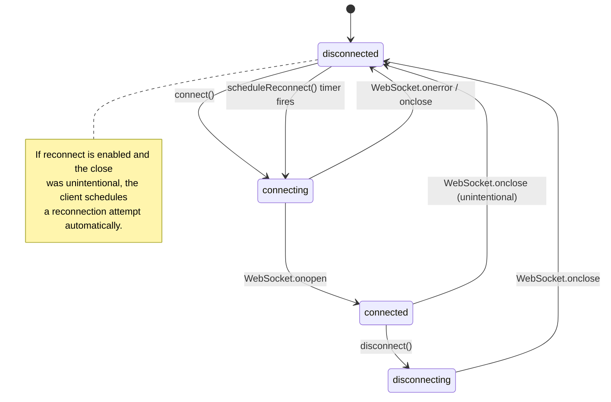
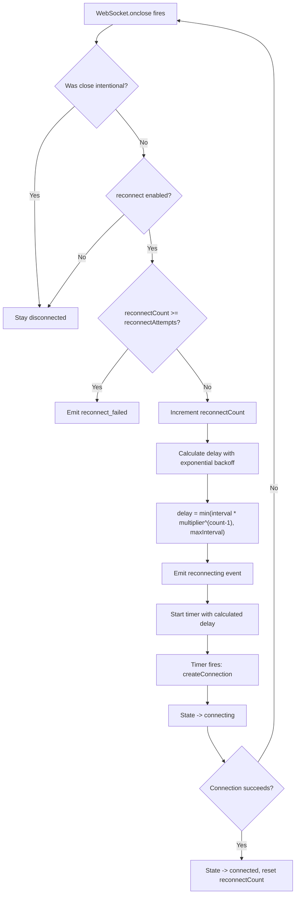
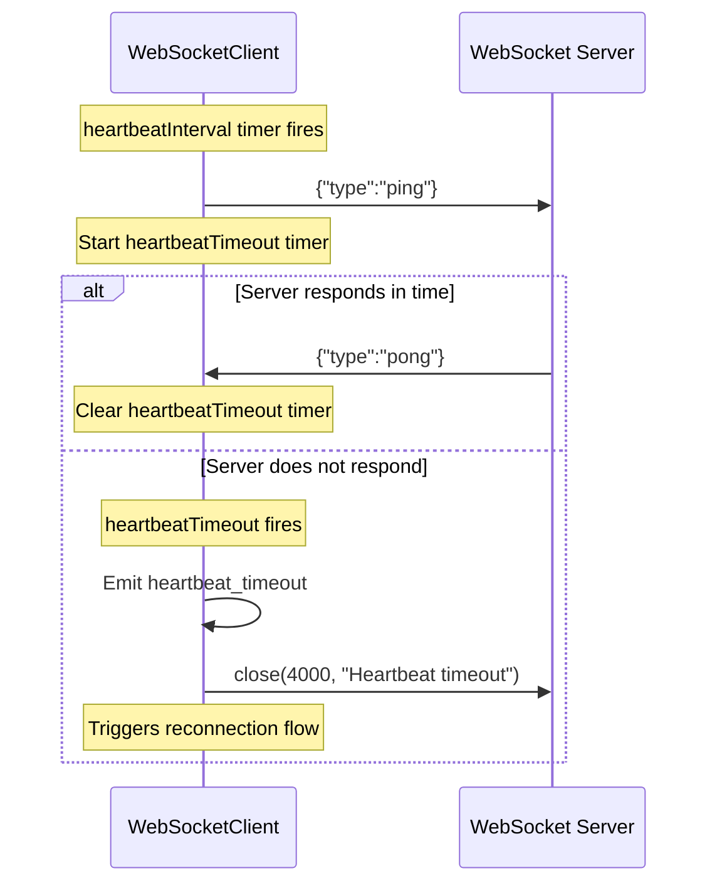
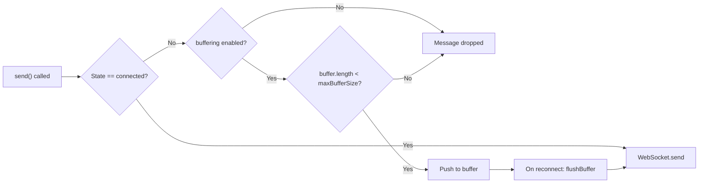
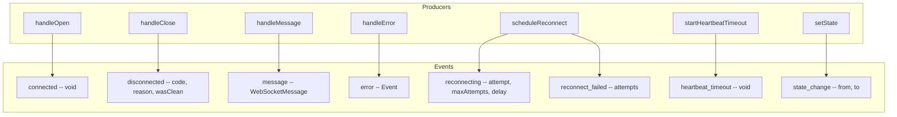
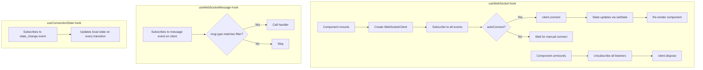
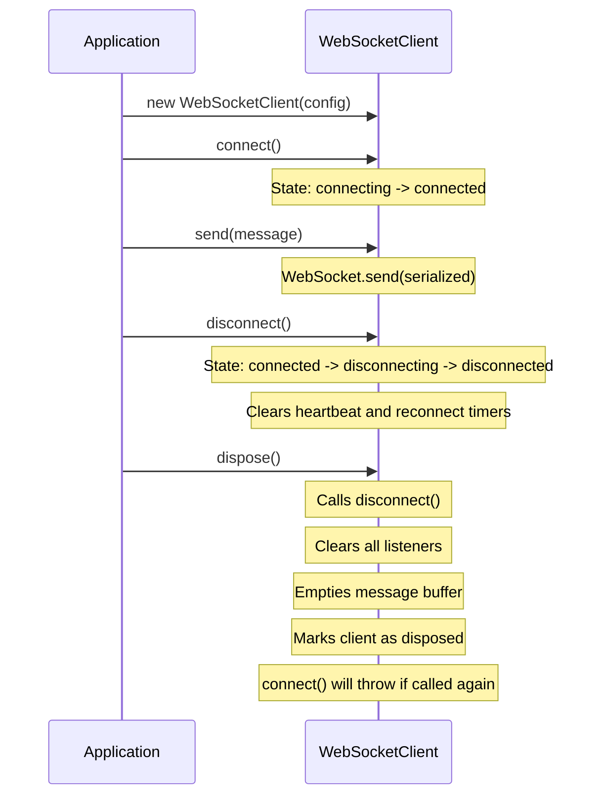

# WebSocket-Client-TS Architecture

## Overview

WebSocket-Client-TS is a framework-agnostic WebSocket client library for TypeScript with optional React bindings. The architecture separates the core connection management (state machine, reconnection, heartbeat, buffering) from the UI integration layer (React hooks), allowing tree-shaking of unused code.

## Module Structure

```
src/
  types.ts      -- Shared types, interfaces, configuration defaults
  client.ts     -- Core WebSocketClient class (framework-agnostic)
  hooks.ts      -- React hooks (useWebSocket, useWebSocketMessage, useConnectionState)
  index.ts      -- Public barrel export
```

### Layer Separation

- **types.ts** defines all contracts: `WebSocketConfig`, `ConnectionState`, `WebSocketMessage`, `WebSocketEventMap`, and `DEFAULT_CONFIG`. No runtime logic.
- **client.ts** implements the `WebSocketClient` class using only the global `WebSocket` API. It has zero framework dependencies and works in browsers, Node.js 21+, Deno, and Bun.
- **hooks.ts** provides React-specific bindings. React is a peer dependency, so consumers who do not use React pay no cost for these exports.

## Client State Machine

The `WebSocketClient` maintains a `ConnectionState` that transitions through four states. All transitions emit a `state_change` event.



### State Descriptions

| State | Meaning |
|---|---|
| `disconnected` | No active WebSocket connection. The client may be idle or waiting for a reconnect timer. |
| `connecting` | A `new WebSocket()` call has been made; waiting for `onopen` or `onclose`. |
| `connected` | The WebSocket is open. Messages can be sent and received. Heartbeat is active (if configured). |
| `disconnecting` | `disconnect()` was called; `WebSocket.close()` has been invoked but `onclose` has not yet fired. |

## Reconnection Flow

When an unintentional disconnection occurs and `reconnect` is enabled, the client uses exponential backoff to schedule reconnection attempts.



### Backoff Formula

```
delay = min(reconnectInterval * reconnectBackoffMultiplier ^ (attempt - 1), maxReconnectInterval)
```

With default values (`interval=1000ms`, `multiplier=2`, `max=30000ms`):

| Attempt | Delay |
|---|---|
| 1 | 1,000 ms |
| 2 | 2,000 ms |
| 3 | 4,000 ms |
| 4 | 8,000 ms |
| 5 | 16,000 ms |
| 6+ | 30,000 ms (capped) |

## Heartbeat Mechanism

When `heartbeatInterval` is set to a value greater than zero, the client sends periodic ping messages and expects pong responses within a timeout window.



### Heartbeat Configuration

| Parameter | Default | Description |
|---|---|---|
| `heartbeatInterval` | `0` (disabled) | Interval in ms between ping messages |
| `heartbeatMessage` | `'{"type":"ping"}'` | The raw string sent as the ping |
| `heartbeatResponseType` | `'pong'` | The `type` field expected in the pong response |
| `heartbeatTimeout` | `5000` | Time in ms to wait for a pong before closing the connection |

## Message Buffering

When `bufferWhileDisconnected` is `true` (the default), messages sent while disconnected are queued in an internal buffer. Upon reconnection, the buffer is flushed in FIFO order before any new messages are sent.



The buffer is capped at `maxBufferSize` (default: 100 messages). Messages exceeding the cap are silently dropped.

## Event System

The client uses an internal event emitter pattern. Each event type is defined in `WebSocketEventMap` with its payload type. Listeners are stored in `Set` collections per event name, and every `on()` call returns an unsubscribe function.



## React Integration Layer

The hooks in `hooks.ts` wrap the core `WebSocketClient` with React lifecycle management.



### Hook Dependency Management

- `useWebSocket` re-creates the client only when `url` or `autoConnect` changes, avoiding unnecessary connection teardowns.
- Callback refs (`useRef`) are used for event handlers to maintain stable subscriptions across re-renders without causing effect re-runs.
- The `send`, `sendJSON`, `connect`, and `disconnect` functions are wrapped in `useCallback` for referential stability.

## Lifecycle and Resource Cleanup



## Design Decisions

1. **Framework-agnostic core**: The `WebSocketClient` class depends only on the global `WebSocket` API, making it usable in any JavaScript runtime.

2. **Tree-shakeable React hooks**: React is a peer dependency. Applications that do not use React will not bundle the hooks module.

3. **Event-driven over callback injection**: Rather than accepting callbacks in the constructor, the client uses an `on`/`off`/`once` event system. This allows multiple subscribers and dynamic subscription management.

4. **Unsubscribe-by-return**: Every `on()` and `once()` call returns an unsubscribe function, eliminating the need to keep listener references for cleanup.

5. **Typed message envelope**: All messages follow the `{ type, payload, timestamp }` structure, enabling type-filtered subscriptions via `useWebSocketMessage`.

6. **Dual output format**: The library builds to both CommonJS and ESM via tsup, supporting all bundler and runtime configurations.
